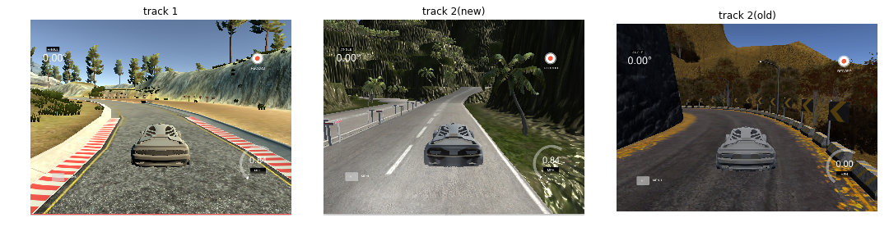
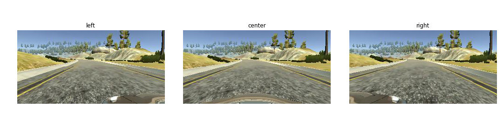
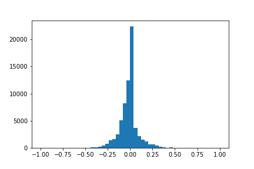
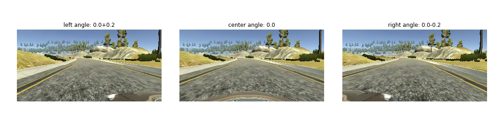
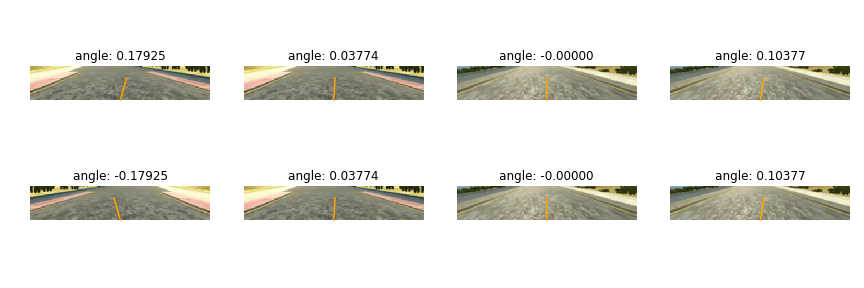
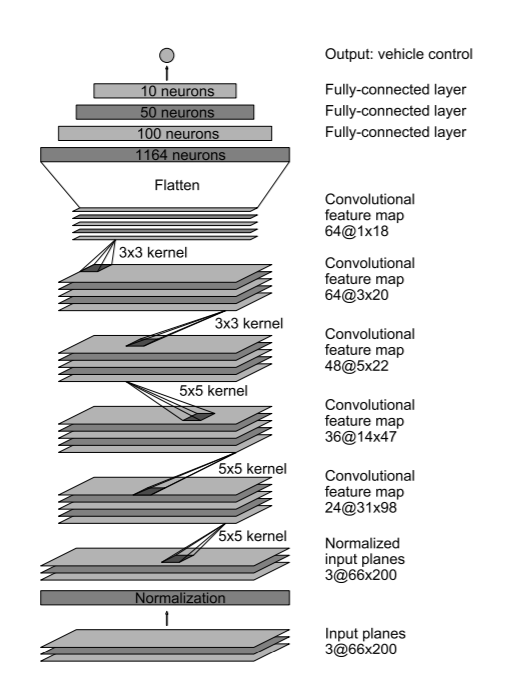
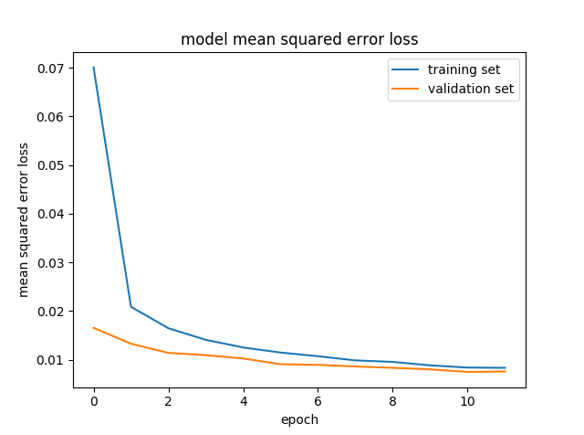
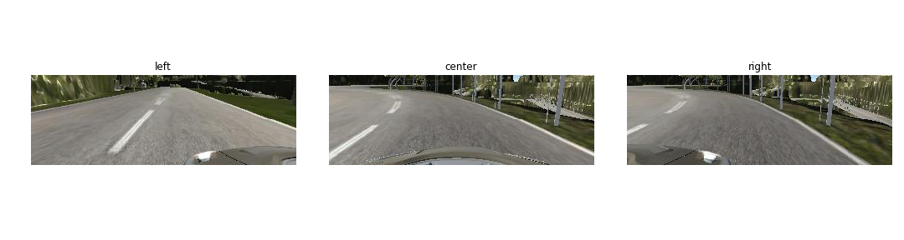
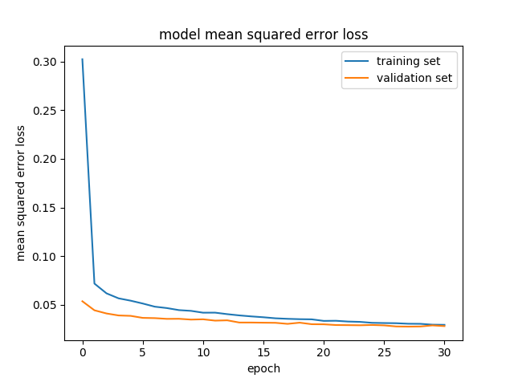

# **Behavioral Cloning project** 

## Yang Xiong
## This project is the 3rd project of self driving nano degree
**[Table of Contents](http://tableofcontent.eu)**
- [1. Introduction](#1-introduction)
- [2. Data visualization](#2-data-visualization)
- [3. Model Architecture and Training Strategy](#3-model-architecture-and-training-strategy)
  - [3.1 Model Architecture](#31-model-architecture)
  - [3.2 Training process](#32-training-process)
- [4. Performance evaluation](#4-performance-evaluation)
  - [4.1 track 1 video](#41-track-1-video)
  - [4.2 track 2(new) video](#42-track-2new-video)
  - [4.3 track 2(old) video](#43-track-2old-video)
- [5. The right only model](#5-the-right-only-model)
  - [5.1 track 2(new) right only video](#51-track-2new-right-only-video)
  - [5.2 track 2(old) right only video](#52-track-2old-right-only-video)

# 1. Introduction
The main goal of this project, is to build an end to end deep learning model, which is capable of driving a car in a simulator provided by Udacity.<br>
<br>
The throttle and brake are automatically controlled to a fixed value, our model is designed to predict steering wheel angle according to each image frame from the centor camera of the car. There are totally three tracks: two tracks from current simulator Udacity provides, another one from the older version simulator. 
Here are examples of all three tracks:<br>

**Please note: For section 1 to 4, I will only talk about the model trained from track 1, because Udacity requires only track 1 for the rubic points. I will talk about model trained from track 2(new) data in section 5**
<br>
 In general, in order to achive the goal, here's what I have done:
* Use the simulator to collect data of good driving behavior
* Build a convolution neural network in Keras that predicts steering angles from images
* Train and validate the model with a training, validation and test set.
* Test that the model successfully drives around track one without leaving the road.
* Summarize the results with a written report

My project includes the following files:
* model.py containing the script to create and train the model
* drive.py for driving the car in autonomous mode
* preprocess.py for preprocess images before fed into neural network
* model.h5 containing a trained convolution neural network 
* video.mp4 is the required video file for track 1 
* readme.md summarizing the results
* track_2_model folder contrains slightly different training files for 'only drive in the right side' model.(explanation in section 5)

# 2. Data visualization

First I used the simulator to collect my data set. The simulator is able to capture images from my driving route.
Here are a example of what the simulator provides for a single timestamp:<br>
<br>
Each of these three images are corresponded to a labeled steering wheel angle, which is produced by my driving behavior.<br>
I have collected about 60000 images for training,validation and test sets. Here is the visualization of the distribution of steering wheel angles in all the data I collected:<br>
<br>
As is shown in the figure, I have too much data with steering angle around 0,  and more data in the left than in the right.<br>
In order to get more balanced data, I randomly flip images, to avoid bias to the left.<br>
Also, I add some revocry data from the left and right camera images. Because in the prediction stage, I only use the center camera as the data, in the training stage, I treat left camera and right camera as the center image data, by add a correction of +0.2 angle for left camera images, and -0.2 for the right camera images. My image generator randomly pick one from these three camera image for each timestamp. Through this, I successfully use the left and right images as the recovery data, and avoid the model to be bias to angle 0. The examples are shown below.<br>  

In addition, in order to get more generalized model, I randomly adjust the brightness of the images. <br>
Finally, I crop the images to cut the top 70 rows of pixels(the sky) and the bottom 30 rows of pixels(the vehicle front). This is because the road lines shall be the main focus of the model. The sky and vehicle front only bring noise for the model.<br>
Below are some random examples of the adjusted images:<br>

# 3. Model Architecture and Training Strategy
## 3.1 Model Architecture
My model is from the convolutional neural network model in Nvidia paper: **[End to End Learning for Self-Driving Cars](https://images.nvidia.com/content/tegra/automotive/images/2016/solutions/pdf/end-to-end-dl-using-px.pdf)**<br>
The original paper model architecture is shown as belows:<br>
<br>
I use the same achitecture, but for convolutional layer 5, I use 62*2*2 filters instead of 62*3*3 due to my training input is shaped as (60,320,3), which leads to smaller feature map size in convolutional layer 5.<br>
Besides, I use ELU layers for activations because they have smoother gradient around 0.<br>
Also, I found that after flatten for Covolutional layer 5, the nodes should be 1152 instead of 1164 for the paper, which I doubt maybe a mistake from the original paper. Many people have introduce a 1164 to 1152 fully-connected layer here, which brings millions more nodes for the model.<br>
For my model, my output size after flatten is 2176. As a result, I don't use this additional layer, as such layer may cause a huge overfitting, and slows my traning process. Please note the in the original paper, it clearly says that there are only three Fully-connected layers, which does not count in this layer. <br>
My personalized model achitecture is shown below:<br>

|Layer (type)                       |  Output Shape         | Param #    |   Connected to
|-----------------------------------|-----------------------|------------|------------------------------
|lambda_1 (Lambda)     |(None, 60, 320, 3)    |   0	 |lambda_input_1[0][0] 
conv1 (Convolution2D) |  (None, 28, 158, 24)  |1824 |lambda_1[0][0]           
elu_1 (ELU)         |             (None, 28, 158, 24)  | 0     |      conv1[0][0]                
conv2 (Convolution2D)       |     (None, 12, 77, 36)  |  21636    |   elu_1[0][0]                
elu_2 (ELU)              |        (None, 12, 77, 36) |   0      |    conv2[0][0]                 
conv3 (Convolution2D)        |    (None, 4, 37, 48)   |  43248    |   elu_2[0][0]           
elu_3 (ELU)            |          (None, 4, 37, 48)  |   0       |    conv3[0][0]           
conv4 (Convolution2D)   |         (None, 2, 35, 64)  |   27712    |   elu_3[0][0]               
elu_4 (ELU)            |          (None, 2, 35, 64) |    0       |    conv4[0][0]               
conv5 (Convolution2D)   |         (None, 1, 34, 64)  |   16448   |    elu_4[0][0]               
elu_5 (ELU)               |       (None, 1, 34, 64)  |   0        |   conv5[0][0]               
fc0 (Flatten)         |           (None, 2176)   |       0    |       elu_5[0][0]               
fc1 (Dense)            |          (None, 100)      |     217700  |    fc0[0][0]                 
elu_6 (ELU)         |             (None, 100)   |        0    |       fc1[0][0]                 
fc2 (Dense)          |            (None, 50)    |        5050   |     elu_6[0][0]               
elu_7 (ELU)         |             (None, 50)    |        0       |    fc2[0][0]                 
fc3 (Dense)           |           (None, 10)    |        510    |     elu_7[0][0]               
elu_8 (ELU)        |              (None, 10)    |        0      |     fc3[0][0]                 
output (Dense)         |          (None, 1)       |      11      |    elu_8[0][0]       

Total params: 334,139<br>
Trainable params: 334,139<br>
Non-trainable params: 0<br>
I use ADAM with default parameters as optimizer, and mean square error as the loss evaluation of my model.
## 3.2 Training process
First, I would say that I did not resize the images because I want to keep all the input features. And also my 1080ti supporst my fast trainig process.<br>
For my first several attemps of traings, I use only 30000 images from normal rounds of driving data. But it turns out the performance is not stable in curve road and bridge. So I end up collect more data for specific areas for my training set. My final model uses training data which contains 60000 images data.<br>
I shuffle the data, and split data into training, validation and test sets as shown below.
```
train size:49600
valid size:13184
test size:3366
```
For my final model, I use a input generator of batch size 256 for my model.Such generator saves my RAM space from running out of memory during training. For validation generator, I make it only output center images, since only the center images are the ground truth.<br>
For test sets, since it's a small data set, I don't use a generator. Also I only use the center images for the test set, as they are the ground truth data.
I set two keras Callbacks to let model automatically do a early stop if validation loss increase for a specific epoch, and let it saves checkpoints for each epoch.<br>
The Callbacks are shown below:
```python
# Set an early stop call back to make model stop training if validation loss increases
early_stop = EarlyStopping(monitor='val_loss',
                           min_delta=0.0001,
                           patience=0,
                           verbose=0,
                           mode='auto')

# Set a callback to save model in each epoch
check_pointer = ModelCheckpoint('weights.{epoch:02d}-{val_loss:.2f}.hdf5',
                                monitor='val_loss',
                                verbose=0,
                                save_best_only=False,
                                save_weights_only=False,
                                mode='auto',
                                period=1)
```
The model stops traing at 11 epochs. Below is the training loss performance during training.<br>
<br>
The model seems not overfitting, so I don't apply regularization for the model.<br>
The final model performance is:<br>
```
training loss: 0.011
validation loss: 0.09
test loss: 0.01
```
# 4. Performance evaluation
The model performs well on the data set, but needs to be evaluated for the performance for driving in the track.<br>
As shown below, the final model performs well on track1, track 2(new), and track 2(old). (even if it never sess track 2(new) and track 2(old), it knows that car should stay in the middle)<br>
Below are the performance of the model on three tracks.<br>
(Please click the images for the youtube video)
## 4.1 track 1 video
[](https://www.youtube.com/watch?v=yDcx4N22DEg&t=10s)
## 4.2 track 2(new) video
[](https://youtu.be/XGjYrqN8QKo)
## 4.3 track 2(old) video
[](https://youtu.be/Zo8_rY-rlkE)

# 5. The right only model
I have trained a seperate model for the car driving in right only.<br>
The dataset is from track2(new).
Below are the samples of right only data set.<br>
<br>
I use the same model achitecture as the previous model, but apply different cropping strategy.<br>
I crop out top 50 pixels and bottom 20 pixels, as I want the model to see further for this track.<br>
Originally I only use 25000 images to train this model, but the performance is not great on some extreme curves. So I ends up collects 6000 more images for these curves. <br>
The final data size for model 2 is:<br>
```
train size:32832
valid size:8832
test size:2229
```
I resize image to (56,128) for faster training speed.<br>
I use batch size 756 for this model, because it is harder to converge.<br>
I also apply early stop callback to let model automatically stops.<br>
The model ends up using 30 epochs to stop.<br>
The training loss is shown below:<br>
<br>
Note that for the whole training process, only the last two epochs are using the data with curves data. I use the concept of 'transfer learning' and 'online learning' to load my model from the 28th epoch checkpoint, and re-train the last two epochs of model with data which includes curves roads. This saves me a lot of time to retrain the model from scratch.<br>
Final perfomance for right only model can be found below. It performs well on driving in right only for both these two tracks<br>
## 5.1 track 2(new) right only video
[](https://youtu.be/UXAQ2TbkogQ)
## 5.2 track 2(old) right only video
[](https://youtu.be/gwGBxBZdnUI)
